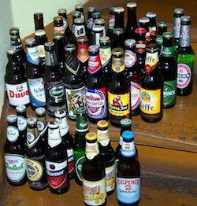

# Beer shopper 2
(See _Beer shopper_ for full introduction)



It turns out giving away beer for free is a great way to get new friends! Greg has made so many new friends he has trouble keeping up with demand.

Luckily he has a friend working in a brewery, who has come up with a deal where Greg can buy beer in bulk. The beer from the brewery comes in boxes with `198` beers.

As before Greg wants to share exactly one beer with each of his friends, without having any excess beer (which will lead to fighting). Write a program that determines whether it is possible to buy beer from the brewery in such a way that each of his _f_ friends get exactly one.

Note that this time Greg has got _really_ many friends.

## Input
Input consists of a single line with a single integer _f_, the number of friends Greg wants to buy beer to.

## Output
If it is possible to buy a number of boxes such that there is exactly one beer for each of Greg's friends, simply output `BEER!`. Otherwise output `FIGHT!`.

## Constraints
0 < _f_ &le; 10<sup>10<sup>6</sup></sup>

## Sample input 1
```
100
```

## Sample output 1
```
FIGHT!
```

## Sample input 2
```
198
```

## Sample output 2
```
BEER!
```

## Sample input 3
```
297
```

## Sample output 3
```
FIGHT!
```