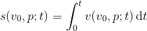

# Flaps on a plane
Maverick is a hotshot pilot, working his way up the ranks in an airline. Lately Maverick has had difficulties getting his landings right. When landing, Maverick likes to rely on the flaps for breaking. The position of the flaps _p_ is given as a real number between 0 and 1, where 1 means fully retracted.


In an attempt to gain more control over his landings, Maverick has come up with the following model for the speed of the aircraft.


This formula describes the speed of the aircraft at time _t_, given the landing velocity _v<sub>0</sub>_ and the flaps position _p_. The formula assumes that the aircraft touches down at _t_ = 0. Maverick doesn't know anything about formulas, but he wants to know how far the aircraft moved up the runway at time _t_, given _v<sub>0</sub>_ and _p_. The distance the aircraft has moved since touch down is described by the following formula.



Help Maverick out by writing a program that calculates how far the aircraft has moved since it touched down, given _v<sub>0</sub>_, _t_ and _p_.

## Input
Input consists of a single line containing three real, positive numbers _v<sub>0</sub>_, _t_ and _p_, respectively.

## Output
Output the position of the plane at time _t_ if the flaps are in position _p_ and the landing velocity is _v<sub>0</sub>_.

Note: Output must have an absolute error less than 10<sup>-7</sup>. So if _s<sub>0</sub>_ is correct, then all answers _s_ such that |_s_ - _s<sub>0</sub>_| < 10<sup>-7</sup> will be accepted.

## Constraints
0 &le; _v<sub>0</sub>_, _t_ &le; 100  
0 < _p_ &le; 1

## Sample input 1
```
100 1 0.2
```
## Sample output 1
```
77.79364224
```

## Sample input 2
```
100 100 1
```
## Sample output 2
```
200.00000000
```