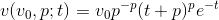
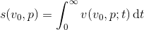

# Flaps on a plane 2
(see _Flaps on a plane_ for full introduction)

It turns out Maverick isn't as good as he thinks, and needs more help finding the correct flap position. As before, Maverick is assuming that the speed of the aircraft is as described by the formula below.



For each airport, there is an ideal position _s_ (relative to where the aircraft touched down) for the aircraft to stop. The stopping position of the plane is given by the formula below, which depends on _v<sub>0</sub>_ and _p_.



Write a program that finds the correct flap position _p_ so the aircraft stops in the ideal position. You can assume that such a position exists.

## Input
Input consists of a single line containing two real, positive numbers _v<sub>0</sub>_ and _s_.

## Output
Output _p_, the position the flaps must be in for the aircraft to stop at position _s_, given _v<sub>0</sub>_, the landing speed.

Note: Output must have an absolute error less than 10<sup>-7</sup>. So if _p<sub>0</sub>_ is correct, then all answers _p_ such that |_p_ - _p<sub>0</sub>_| < 10<sup>-7</sup> will be accepted.

## Constraints
0 &le; _v<sub>0</sub>_ &le; 100  
_v<sub>0</sub>_ &le; _s_ &le; 2 _v<sub>0</sub>_  
0 < _p_ &le; 1

## Sample input 1
```
100 150
```
## Sample output 1
```
0.32532542
```

## Sample input 2
```
50 70
```
## Sample output 2
```
0.23039472
```