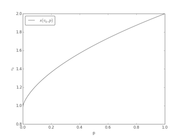

# Flaps on a plane 2
Use the solution from _Flaps on a plane_. If working with infinity is an issue, the improper integral can be estimated by for instance integrating to _t_ = 50 (the function is basically 0 beyond this point).

From here on in it's only a matter of applying some appropriate root-finding algorithm to find _p_.

By plotting the stopping position as a function of _p_, it's clear that this function is stricly increasing (see plot).

Since this function is stricly monotonic [bisection](http://en.wikipedia.org/wiki/Bisection_method) will work fine.
Newton's method is a little tricky due to irregularities in the gamma function. SciPy has several methods that will work.