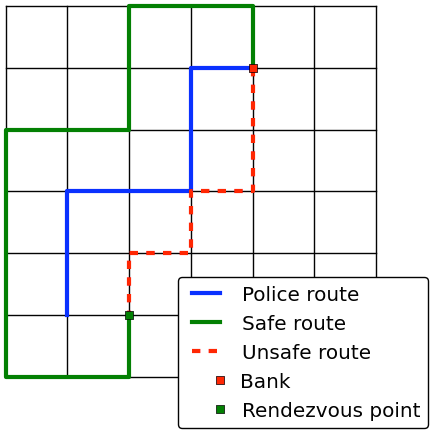

# The getaway driver
Frank, a professional getaway driver, is hired to safely transport some robbers from a heist at the local bank. Getting away safely is quite easy, you just have to stay away from the police at all times. When the alarm goes off, the police will drive to the bank. Having a snitch within the police force, Frank knows exactly which route the police are going to take, so staying away from them should be easy.

Frank doesn't know when the police leave the police station (sometimes they are busy when the alarm goes off), nor how fast they are going. So the only way to stay entirely safe is to avoid their route all together. In practice this means that Frank cannot drive via any intersection that the police drive via (except the one at the bank, of course). This way he is sure he'll never get caught.

An example of this can be seen in the image below, where the green (and long) route is safe. The red route however, is unsafe because it goes via an intersection on the police route.



In order to put a fair price on the job, Frank needs to now how far he has to go in order to make a safe getaway. Make a program that outputs the length (in meters) of the shortest possible route Frank can take from the bank to the rendezvous point, while still being safe. If no such route exists Frank should back away from the deal.

The streets in city Frank lives in are layed out as a grid. It consists of _n_ streets going west-east and _m_ streets going north-south. The streets have an even spacing of `10m`, so the distance from an intersection to any of its neighboring intersection is always `10m`.

The bank is located at intersection [_b<sub>i</sub>_, _b<sub>j</sub>_]  
The rendesvous point is at instersection [_r<sub>i</sub>_, _r<sub>j</sub>_]  

## Constraints
2 < _n_, _m_ &le; 100  
0 < _k_ &le; _n_ &middot; _m_  
0 &le; _b<sub>i</sub>_, _r<sub>i</sub>_ < _n_  
0 &le; _b<sub>j</sub>_, _r<sub>j</sub>_ < _m_

## Input
The first line of input contains two integers _n_ and _m_, the size of the city.  
The second line contains four integers _b<sub>i</sub>_, _b<sub>j</sub>_, _r<sub>i</sub>_ and _r<sub>j</sub>_. This is the location of the bank and the rendezvous point, respectively.  
Then follows _k_ lines describing the route that the police are taking. Each line contains two integers _p<sup>l</sup><sub>i</sub>_ and _p<sup>l</sup><sub>j</sub>_, the coordinates of the _l_-th intersection on the route of the police.

## Output
Output the shortest possible distance Frank has to drive from the bank to the rendezvous point without getting caught. If no such route exists, simply output `no deal`.

## Sample input 1
```
7 7
1 4 5 2
5 1
4 1
3 1
3 2
3 3
2 3
1 3
1 4
```
## Sample output 1
```
60
```
## Sample input 2
```
3 3
0 0 2 2
1 0
1 1
0 1
0 0
```
## Sample output 2
```
no deal
```