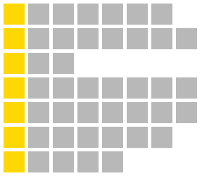

# Nuts
Johnny is working as the executive mathematician at NRK's _Påskenøtter_ division. At NRK they have been struggling with having too many people solve all of the puzzles, and as a result they've asked Johnny to device new schemes for _Påskenøtter_.



Since Johnny isn't particularily creative, his main focus has been to investigate the number of ways to fill out the board. A board consists of _r_ rows, each of which can have a different number of cells, _c<sub>i</sub>_. Johnny has also been experimenting with using different alphabets, so each cell can hold one of _n_ characters.

Johnny has now come up with a lot of different combinations of boards and alphabets, but has no idea which one to choose. Since the goal is to make _Påskenøtter_ as difficult as possible, Johnny needs your help selecting the scheme which can be filled out in the largest number of ways. Of course, most of these "solutions" won't be actual solutions, they'll just be gibberish, but we don't care about that for now.

## Input
Input consists of _k_ lines.

Each line starts with an integer _n_, the number of characters in the alphabet. Then follows _r_ integers _c<sub>i</sub>_, which describes how many cells there are in row _i_.

## Output
You should output the index (0-indexed, that is) of the scheme with the most number ways to fill out. You can assume that all schemes have a unique number of ways to fill out.

## Constraints
0 < _k_ &le; 10<sup>3</sup>  
0 < _r_ &le; 10  
0 < _n_, _c<sub>i</sub>_ &le; 10<sup>6</sup>

## Sample input
```
29 5 5 5
29 4 5 6 7
29 7 8 19 20 10
```
## Sample output
```
2
```
