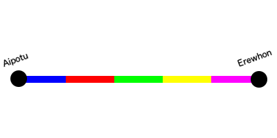

# Railway management [hard]
The young nation of Utopia have recently finished building their first railway, running all the way from the capital Aipotu to the city of Erewhon. The railway is split into _n_ segments, numbered from `0` to `n - 1`, where Aipotu is located at segment `0` and Erewhon is located at segment `n - 1`. Along the railway there are many small cities and villages, each connected to some railway segment. All of the trains depart either from Aipotu or Erewhon, since all the other cities along the railway are too small to have their own train yard.



Since the utopians are quite inexperienced in the art of operating a railway, there tends to be quite a few problems with the rails, or broken trains blocking the railway and so on. Therefore they need you to build an information system that can tell them whether a particular rail segment currently is reachable from either terminal station.

The system will receive three types of messages:

- Error report  
	stating that a specific rail segment is blocked
- Repair report  
	stating that a specific rail segment is reopened after being blocked
- Status request  
	querying whether a specific rail segment is reachable from Aipotu or Erewhon

The system should take note of all the reports, and output either `good service` or `no service` to each status request. A segment has `no service` if the segment itself is blocked, or there is a blockage between the segment and both of the terminal stations.

At the beginning of the day all of the segments of the railway line are assumed to be opened.

## Input specification
The first line of input contains a single integer _n_, the number of segments on the railway line.

Then follows _k_ lines, representing the messages. Each line contains an integer _i_, the index of the segment the message is referring to, and a word _w_, the type of message. _w_ will be either `blocked`, `opened` or `status`. There will only be issued `blocked` messages for segments that are already opened, and visa versa.

## Output specification
For each line containing a `status` message your program should output either `good service` or `no service`, according to the railway's current status.

## Constraints
2 &le; _n_ &le; 10<sup>5</sup>  
0 &le; _k_ &le; 10<sup>5</sup>  
0 &le; _i_ < _n_

## Sample input
```
5
0 status
2 status
4 status
2 blocked
2 status
3 status
4 blocked
3 status
4 opened
3 status
```
## Sample output
```
good service
good service
good service
no service
good service
no service
good service
```
