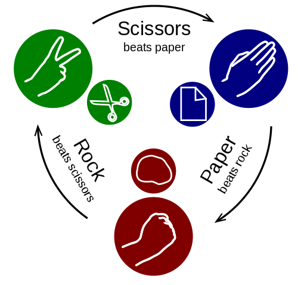

# Rock, paper, scissors [hard]

The old game of Rock-Paper-Scissors goes as follows:  Each of two players chooses either "Rock", "Paper", "Scissors" and they expose their choice simultaneously.
Then if they have chosen the same sign, the game is drawn and they will have to play again.
If not, the rules are that rock beats scissors, scissors beat paper and paper beats rock.



Your friend just came up with a new version of the game and it goes as follows:  You play three rounds of Rock-Paper-Scissors, where you have to use every sign exactly once during the three rounds.
The winner of the game is the winner of the third round.  

Now your friend wants to try this new game with you and he wants to play for 10000 rounds.
For each game, you will get a score of 1 point if you win, 0.5 points if you draw and 0 points if you lose.
You don't want to make a fool of yourself, so you want to score more than 4750 points in (almost) any case. In other words, you want to beat your friend for each possible strategy he may choose. Your task is to write a program for achieving this.

## Input
The first line of input will contain an integer _T_, the number of test cases.
Then for each test case, there will be 10000 lines with two space separated words drawn both with uniform probability from the set {"Rock", "Paper", "Scissors"}, the first play of a round from you and your friend, respectively.

## Output
For each test case, output 10000 lines, each line containing a single word.
The word on the i'th line denoting your second play on the i'th round.
(Your third play will then be completely determined).

The output for a test case will be considered correct if all your plays are valid, and if your total score is larger than 4750.
Your solution will be considered correct if it gives a correct output to each test case. 

## Constraints
1 &le; _T_ &le; 100

## Sample input
```
1  
Rock Paper  
Paper Paper  
Rock Scissors  
Scissors Rock  
...+9996 more lines  
```

## Sample output
```
Paper  
Rock  
Paper  
Rock  
...+9996 more lines  
```

## Sample opponent play (Hidden)
```
Scissors  
Rock  
Rock  
Paper  
...+9996 more lines  
```

## Sample score
```
0-1 (Scissors-Rock)  
1/2-1/2 (Scissors-Scissors)  
1-0 (Scissors-Paper)  
0-1 (Paper-Scissors)  
...+9996 more lines   
```
