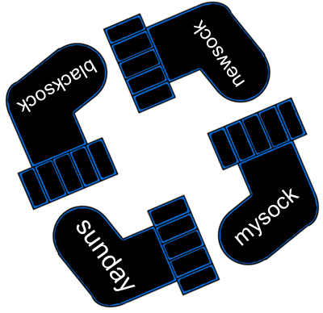

# Socks
Matias works as a programmer, and like most programmers these days, he spends a lot of time working in his terminal window.
When Matias is not at work, he spend his time figuring out what to wear at work the next day, because he thinks it is essential to be classy and good looking at work.
Since the background of his terminal is black, he always wear black socks at work to make sure that he matches the computer.




With a drawer full of black socks, it is very hard to find matching pairs, so Matias has come up with a very smart system.
Every time he buys a new pair of socks, he picks a random word and make sure that both of the new socks are labeled with that word.
This way, he can easily check if two socks are a match, simply by looking at the word written on the socks.
Once in a while he buys many socks that are all equal.
Then it does not really matter which of them he pairs together, so he labels them all with the same word.

Like every other person, Matias has a washing machine which eats socks.
So every time he has washed them, he collects them all to throw away socks that can not be paired together with any other sock.
Matias wants to make a program to do this boring task for him, but since he is not very good with algorithms (he only configures servers at work), he asks you to help him.
Help Matias to throw away as few socks as possible while making sure that each remaining sock can be paired with at least one other sock.


## Input:
The first line of input contains one integer _N_, the number of socks Matias has washed today.

Then follows _N_ lines, each containing one string.
The string on line _i_ represents the text written on the _i_'th sock.
The strings will only contain the lowercase letters from the english alphabet.

## Output:
Output a list sorted alphabetically with all the socks Matias should remove.
If he does not need to remove any socks, output "Sock-sess"

## Constraints
1 &le; _N_ &le; 100

## Sample input 1:
```
6
tuesday
monday
tuesday
monday
saturday
saturday
```

## Sample output 1:
```
Sock-sess
```


## Sample input 2:
```
4
bluesock
redsock
bluesock
bluesock
```

## Sample output 2:
```
redsock
```


