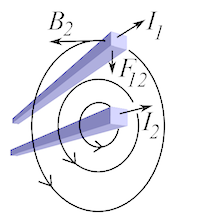

# Wired
Jan, an electrician, likes to design electrical circuits. As you know, around any conductor with a current, a magnetic field is induced. Jan must take this into account when he designs his electrical circuits, otherwise they might break due to forces between the wires.



Jan has decided to use duck tape to strap the wires to the circuit board. Unfortunately, the duck tape Jan can only withstand lateral forces (forces that are orthagonal to the wire, that is). Taking all the physics into account, this means that the circuit will break unless all pairs of wires are either perfectly parallell or orthogonal.

Write a program that decides if the circuit will break or not, given one of Jan's designs. There is no room for error, so make sure that your calculations are accurate (i.e. don't use any floats!).

## Input
The first line of input contains a single integer _n_, the number of wires.

Then follows _n_ lines, each describing a wire. Each such line contains four integers _x<sub>1</sub>_, _y<sub>1</sub>_, _x<sub>2</sub>_, _y<sub>2</sub>_, representing a wire which goes through the points (_x<sub>1</sub>_, _y<sub>1</sub>_) and (_x<sub>2</sub>_, _y<sub>2</sub>_) on the circuit board. (_x<sub>1</sub>_, _y<sub>1</sub>_) and (_x<sub>2</sub>_, _y<sub>2</sub>_) will not be equal, and no wires will be duplicate.

All wires extend to the end of the circuit board, so for all practical concerns they might be considered to be infinitely long.

## Output
If the circuit will break, output `broken`, otherwise output `wire it up`.

## Constraints
1 &le; _n_ &le; 10<sup>4</sup>  
|_x<sub>1</sub>_|, |_x<sub>2</sub>_|, |_y<sub>1</sub>_|, |_y<sub>2</sub>_| &le; 10<sup>5</sup>  

## Sample input 1
```
3
0 0 1 1
1 0 2 1
0 0 1 -1
```

## Sample output 1
```
wire it up
```

## Sample input 2
```
3
0 0 1 1
1 0 2 1
0 0 0 1
```

## Sample output 2
```
broken
```
